# Prior Systems - Comprehensive Architecture Diagram

## Interactive Mermaid Diagram

```mermaid
graph TB
    subgraph "Client Layer"
        Browser["🌐 Web Browser<br/>Chrome, Firefox, Safari"]
        LocalStorage["💾 Local Storage<br/>• Portfolio Configs<br/>• Chart Styles<br/>• User Preferences"]
    end

    subgraph "Vercel Edge Network - Frontend CDN"
        NextJS["⚡ Next.js 16 App Router<br/>TypeScript | React 18<br/>Server-Side Rendering"]
        EdgeFunc["🔧 Edge Functions<br/>API Routes<br/>Middleware"]
    end

    subgraph "Frontend Application - 8,000+ Lines TypeScript"

        subgraph "Core Pages"
            LivePrices["📊 Live Prices<br/>• Real-time Portfolio Tracking<br/>• Multi-asset Support<br/>• Auto-refresh (5min)<br/>• P&L Calculation"]
            Backtest["🎯 Backtest Console<br/>• Dual-mode Trading<br/>• Strategy Builder<br/>• Results Visualization"]
            DataSelection["📁 Data Selection<br/>• CSV Upload (50K+ rows)<br/>• Date Range Picker<br/>• Dataset Manager"]
            Dashboard["🏠 Dashboard<br/>• User Overview<br/>• Quick Actions<br/>• Navigation Hub"]
        end

        subgraph "Mechanical Trading Mode"
            StrategyBuilder["⚙️ Strategy Builder<br/>• Custom Parameters<br/>• Position Sizing<br/>• Commission/Slippage"]
            TechIndicators["📈 Technical Indicators (15+)<br/>• SMA, EMA (Multiple periods)<br/>• RSI, MACD, Stochastic<br/>• Bollinger Bands<br/>• Volume Analysis"]
            BuiltinStrategies["🤖 Built-in Strategies<br/>• Buy & Hold<br/>• MA Crossover<br/>• RSI Mean Reversion"]
        end

        subgraph "Fundamental Trading Mode"
            ManualMode["🖱️ Manual Trading UI<br/>• Click-to-Trade<br/>• Interactive Charts<br/>• Real-time Feedback"]
            OptionsUI["📉 Options Interface<br/>• Calls/Puts Selection<br/>• Strike Price Input<br/>• Expiry Date Picker"]
            ExitStrategy["🎯 Exit Strategy Modal<br/>• Stop Loss Config<br/>• Take Profit Config<br/>• Risk/Reward Display"]
            RiskCalculator["📊 Risk Calculator<br/>• Position Size<br/>• R/R Ratio<br/>• Max Loss Display"]
        end

        subgraph "Shared UI Components"
            ChartViz["📉 Chart.js Visualization<br/>• Interactive Charts (10K+ bars)<br/>• Zoom/Pan Controls<br/>• Trade Annotations<br/>• Custom Styling<br/>• <100ms Render Time"]
            StateManagement["⚛️ React State Management<br/>• useState (Complex State)<br/>• useCallback (Memoization)<br/>• useMemo (Performance)<br/>• useEffect (Side Effects)<br/>• 12+ Components"]
            TypeSafety["🔒 TypeScript Type System<br/>• Strict Mode Enabled<br/>• Union Types (number | '')<br/>• Type Guards<br/>• Interface Definitions<br/>• Zero 'any' Types"]
        end
    end

    subgraph "Railway Cloud - Backend API"
        FastAPI["🚀 FastAPI Backend<br/>Python 3.11+ | Async/Await<br/><200ms Avg Latency"]

        subgraph "REST API Endpoints (12 Total)"
            AuthAPI["🔐 /auth<br/>• POST /signup<br/>• POST /login<br/>• POST /logout<br/>• Cookie-based Auth"]
            BacktestAPI["🎲 /backtest<br/>• POST /backtest<br/>• GET /strategies<br/>• Strategy Execution"]
            PortfolioAPI["💼 /portfolio<br/>• GET /portfolios<br/>• POST /save<br/>• PUT /update<br/>• DELETE /delete"]
            DataAPI["📊 /data<br/>• POST /upload-csv<br/>• GET /datasets<br/>• GET /preview<br/>• 50K+ rows support"]
            UserAPI["👤 /user<br/>• GET /settings<br/>• PUT /settings<br/>• GET /profiles<br/>• Profile Management"]
            PricesAPI["💰 /prices<br/>• POST /refresh<br/>• GET /current<br/>• Live Data Fetch"]
        end

        subgraph "Middleware Pipeline"
            CORS["🌍 CORS Handler<br/>• Origin Validation<br/>• Credentials Support<br/>• Regex Patterns<br/>• priorsystems.net"]
            AuthMiddleware["🔑 Auth Middleware<br/>• Cookie Validation<br/>• Session Management<br/>• HTTP-Only Cookies"]
            ErrorHandler["⚠️ Error Handler<br/>• Exception Logging<br/>• Structured Responses<br/>• Status Codes"]
        end
    end

    subgraph "Business Logic Layer - Core Engine"

        subgraph "Backtesting Engine"
            MechSimulator["⚙️ Mechanical Simulator<br/>• Strategy Execution<br/>• Position Sizing<br/>• Commission Calc<br/>• Slippage Modeling<br/>• Trade History"]
            ManualSimulator["🎯 Manual Simulator<br/>• Trade Annotations<br/>• Options Pricing<br/>• Stock Trades<br/>• P&L Tracking<br/>• Exit Management"]
        end

        subgraph "Options Pricing Models"
            BlackScholes["📐 Black-Scholes Model<br/>• Call/Put Pricing<br/>• d1/d2 Calculation<br/>• Normal Distribution<br/>• Risk-free Rate (5%)<br/>• Volatility Input"]
            GreeksCalculator["📊 Greeks Calculator<br/>• Delta (Price Sensitivity)<br/>• Gamma (Delta Change Rate)<br/>• Theta (Time Decay)<br/>• Vega (Vol Sensitivity)<br/>• Real-time Updates"]
            TimeCalculator["⏰ Time to Expiry<br/>• Date Parsing<br/>• Years Calculation<br/>• Expiry Validation"]
        end

        subgraph "Technical Analysis Engine"
            IndicatorLibrary["📈 Indicator Library<br/>• SMA (5,10,20,50,200)<br/>• EMA (12,26)<br/>• RSI (14 period)<br/>• MACD (12,26,9)<br/>• Bollinger (20,2σ)<br/>• Stochastic (14,3,3)"]
            SignalGenerator["🎯 Signal Generator<br/>• Buy/Sell Signals<br/>• Entry/Exit Logic<br/>• Crossover Detection<br/>• Threshold Monitoring"]
        end

        subgraph "Portfolio Analytics"
            PLCalculator["💵 P&L Calculator<br/>• Position-level Tracking<br/>• Daily Gains/Losses<br/>• Total Returns<br/>• Realized/Unrealized<br/>• FIFO Accounting"]
            MetricsEngine["📊 Performance Metrics<br/>• Sharpe Ratio<br/>• Max Drawdown<br/>• Win Rate %<br/>• Avg Trade P&L<br/>• Total Trades"]
            PositionManager["📋 Position Manager<br/>• FIFO Tracking<br/>• Average Cost Basis<br/>• Unrealized P&L<br/>• Multi-asset Support"]
        end
    end

    subgraph "Data Access Layer"
        ORM["🔄 SQLAlchemy ORM<br/>• Async Operations<br/>• Session Management<br/>• Query Optimization<br/>• Relationship Mapping"]
        Models["📝 Database Models<br/>• User (Auth)<br/>• Portfolio (Holdings)<br/>• Dataset (CSV Data)<br/>• Profile (Configs)<br/>• LineStyle (Charts)"]
    end

    subgraph "PostgreSQL Database - Railway"
        UserTable[("👥 User Table<br/>─────────<br/>id (PK)<br/>email (UNIQUE)<br/>hashed_password<br/>created_at<br/>updated_at")]
        PortfolioTable[("💼 Portfolio Table<br/>─────────<br/>id (PK)<br/>user_id (FK)<br/>name<br/>positions (JSON)<br/>lineStyles (JSON)<br/>notes (TEXT)<br/>last_refresh")]
        DatasetTable[("📊 Dataset Table<br/>─────────<br/>id (PK)<br/>user_id (FK)<br/>name<br/>file_path<br/>symbol<br/>start_date<br/>end_date<br/>row_count")]
        ProfileTable[("⚙️ Profile Table<br/>─────────<br/>id (PK)<br/>dataset_id (FK)<br/>start_bar<br/>max_bars<br/>created_at")]
        LineStyleTable[("🎨 LineStyle Table<br/>─────────<br/>id (PK)<br/>portfolio_id (FK)<br/>symbol<br/>color (HEX)<br/>line_width")]
        SettingsTable[("⚙️ Settings Table<br/>─────────<br/>user_id (FK)<br/>active_profile_id<br/>preferences (JSON)")]

        UserTable -.->|"1:N"| PortfolioTable
        UserTable -.->|"1:N"| DatasetTable
        PortfolioTable -.->|"1:N"| LineStyleTable
        DatasetTable -.->|"1:N"| ProfileTable
        UserTable -.->|"1:1"| SettingsTable
    end

    subgraph "External Services & APIs"
        YFinance["📡 yfinance API<br/>• Live Price Data<br/>• Historical OHLCV<br/>• 5-minute Refresh<br/>• Multiple Symbols<br/>• Free Tier"]
        SciPy["🔬 SciPy/NumPy<br/>• Statistical Calculations<br/>• Normal Distribution (CDF)<br/>• Math Operations<br/>• Array Processing"]
    end

    subgraph "Data Storage Systems"
        FileSystem["📁 File System<br/>Railway Volume<br/>• CSV Uploads<br/>• 50K+ Data Points<br/>• Historical Prices<br/>• User Datasets"]
        MemoryCache["⚡ In-Memory Cache<br/>• Price Data<br/>• Session State<br/>• Active Portfolios<br/>• Fast Access"]
    end

    %% Client to Frontend Connections
    Browser -->|"HTTPS (TLS 1.3)"| NextJS
    Browser <-->|"Read/Write JSON"| LocalStorage
    NextJS -->|"Hydration"| EdgeFunc

    %% Frontend Component Connections
    NextJS --> LivePrices
    NextJS --> Backtest
    NextJS --> DataSelection
    NextJS --> Dashboard

    Backtest --> StrategyBuilder
    Backtest --> ManualMode
    StrategyBuilder --> TechIndicators
    StrategyBuilder --> BuiltinStrategies
    ManualMode --> OptionsUI
    ManualMode --> ExitStrategy
    ManualMode --> RiskCalculator

    LivePrices --> ChartViz
    Backtest --> ChartViz
    DataSelection --> ChartViz
    LivePrices --> StateManagement
    Backtest --> StateManagement
    StateManagement --> TypeSafety

    %% Frontend to Backend API
    EdgeFunc -->|"REST API<br/>JSON Payload<br/>HTTPS"| CORS
    CORS --> AuthMiddleware
    AuthMiddleware --> ErrorHandler
    ErrorHandler --> FastAPI

    %% API Routing
    FastAPI --> AuthAPI
    FastAPI --> BacktestAPI
    FastAPI --> PortfolioAPI
    FastAPI --> DataAPI
    FastAPI --> UserAPI
    FastAPI --> PricesAPI

    %% Business Logic Flow
    BacktestAPI --> MechSimulator
    BacktestAPI --> ManualSimulator
    ManualSimulator --> BlackScholes
    BlackScholes --> GreeksCalculator
    ManualSimulator --> TimeCalculator
    MechSimulator --> IndicatorLibrary
    MechSimulator --> SignalGenerator
    PortfolioAPI --> PLCalculator
    PortfolioAPI --> MetricsEngine
    PortfolioAPI --> PositionManager

    %% Data Access Layer
    AuthAPI --> ORM
    BacktestAPI --> ORM
    PortfolioAPI --> ORM
    DataAPI --> ORM
    UserAPI --> ORM
    PricesAPI --> ORM
    ORM --> Models

    %% Database Connections
    Models --> UserTable
    Models --> PortfolioTable
    Models --> DatasetTable
    Models --> ProfileTable
    Models --> LineStyleTable
    Models --> SettingsTable

    %% External Service Integrations
    PricesAPI -->|"HTTP GET<br/>Real-time"| YFinance
    BlackScholes -->|"Import<br/>stats.norm.cdf"| SciPy
    GreeksCalculator -->|"Import<br/>stats.norm.pdf"| SciPy
    IndicatorLibrary -->|"Import<br/>numpy arrays"| SciPy

    %% Storage Systems
    DataAPI --> FileSystem
    BacktestAPI --> FileSystem
    PricesAPI --> MemoryCache
    PortfolioAPI --> MemoryCache

    %% Styling Classes
    classDef frontend fill:#3b82f6,stroke:#1e40af,stroke-width:3px,color:#fff,font-weight:bold
    classDef backend fill:#10b981,stroke:#059669,stroke-width:3px,color:#fff,font-weight:bold
    classDef database fill:#8b5cf6,stroke:#6d28d9,stroke-width:3px,color:#fff,font-weight:bold
    classDef external fill:#f59e0b,stroke:#d97706,stroke-width:3px,color:#000,font-weight:bold
    classDef storage fill:#ef4444,stroke:#dc2626,stroke-width:3px,color:#fff,font-weight:bold

    class NextJS,EdgeFunc,LivePrices,Backtest,DataSelection,Dashboard,StrategyBuilder,ManualMode,ChartViz,StateManagement,TypeSafety,TechIndicators,BuiltinStrategies,OptionsUI,ExitStrategy,RiskCalculator frontend
    class FastAPI,AuthAPI,BacktestAPI,PortfolioAPI,DataAPI,UserAPI,PricesAPI,CORS,AuthMiddleware,ErrorHandler,MechSimulator,ManualSimulator,BlackScholes,GreeksCalculator,TimeCalculator,IndicatorLibrary,SignalGenerator,PLCalculator,MetricsEngine,PositionManager,ORM,Models backend
    class UserTable,PortfolioTable,DatasetTable,ProfileTable,LineStyleTable,SettingsTable database
    class YFinance,SciPy external
    class FileSystem,MemoryCache,LocalStorage storage
```

## Architecture Overview

### Technology Stack Summary

**Frontend (Vercel)**
- Next.js 16 with App Router
- React 18 with TypeScript
- Chart.js for data visualization
- Tailwind CSS for styling
- 8,000+ lines of TypeScript code

**Backend (Railway)**
- FastAPI with Python 3.11+
- PostgreSQL database
- SQLAlchemy ORM
- 12 RESTful API endpoints
- <200ms average response time

**External Integrations**
- yfinance API for market data
- SciPy/NumPy for statistical calculations

### Key Metrics

- **Total Lines of Code**: 15,000+
- **Data Processing**: 50,000+ data points per CSV
- **Render Performance**: <100ms for 10,000+ bars
- **API Latency**: <200ms average
- **Database Tables**: 6 main tables with relationships
- **Active Users**: 10+ from UChicago finance orgs

### Data Flow

1. **User Interaction**: Browser → Next.js → Edge Functions
2. **API Communication**: Frontend → FastAPI → Business Logic
3. **Data Processing**: Business Logic → Database/External APIs
4. **Response**: Database → API → Frontend → User

### Security Features

- HTTP-Only cookies for authentication
- CORS validation with origin checking
- Password hashing with bcrypt
- SQL injection protection via ORM
- Type-safe API contracts

### Deployment Architecture

- **Frontend**: Vercel Edge Network (Global CDN)
- **Backend**: Railway Cloud (US Region)
- **Database**: PostgreSQL on Railway
- **File Storage**: Railway Persistent Volume
